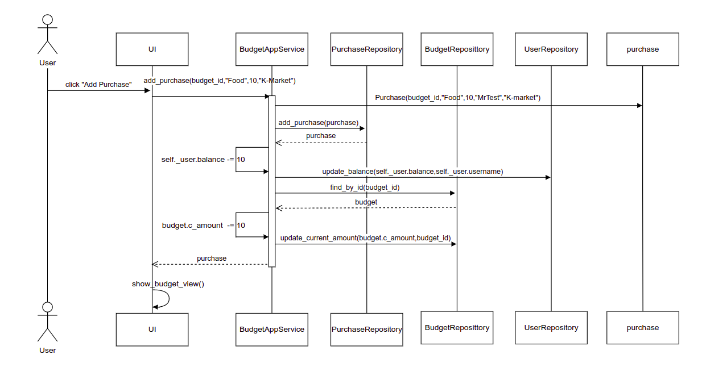

# Architecture
The structure of the program is the following:

The UI-folder contains code for the user interface, the service-folder contains the code for the application logic, the entities-folder contains the different items used by the program. The databases-folder contains the database where data is stored. 
## User Interface
The user interface consists of six different views:
- Login page
- Create User page
- Home page with budget list and user information
- Create Budget page
- Add Purchase page
- View History page

The `UI`-class decides which view is the current one, and there may only be one view present at a time. Each view is defined by an individual class, and all of them use the `BudgetappService`-class methods when needed. As values are updated, the lists update using an `initialize_list()`-function for the specified list. 

## Application Logic

The classes [User](../src/entities/user.py), [Budget](../src/entities/budget.py) and [Purchase](../src/entities/purchase.py) comprises the base of the application logic. 

The service itself is based on the class [BudetappService](../src/service/budgetapp_service.py), which utilizes the entities mentioned above in it's methods, some of which include:

- `login(username,password)`
- `create_budget(name,amount)`
- `add_purchase(budget_id,amount,category,comment)`
- `fetch_user_budgets()`

The classes associated with the database are the following: [UserRepository](../src/databases/users_repository.py), [BudgetRepository](../src/databases/budget_repository.py) and [PurchaseRepository](../src/databases/purchase_repository.py). The _BudgetappService_-class uses these classes to access the user's information, budgets and purchases. 

The compression diagram for the program as a whole looks like this:

## Data Storage
The _databases_-folder contains the code for the different repositories or tables, which are based on three separate classes: [UserRepository](../src/databases/users_repository.py), [BudgetRepository](../src/databases/budget_repository.py) and [PurchaseRepository](../src/databases/purchase_repository.py). Each of these store data into the tables `users`,`budgets` and `purchases` in a SQL-database, which is initialized in the file [init_database.py](../src/init_database.py). The name of the databse-file is determined by and can be configured in the [.env](../.env)-file.

## Main Functions

### Login

After entering as username and password, the click of the "Login"-button has the program go through the following sequence:

The "Login"-button has a handling-function bound to it, that executes the `login(username,password)`-[method](https://github.com/NaND3R5/ot-harjoitustyo/blob/master/budgetapp/src/service/budgetapp_service.py#L111) from the `BudgetappService`-class. 
If the username and password are valid and in existance, which is checked by utilizing the `UserRepository`-class, the view switches the current `LoginView` to `BudgetView` or the home page.

### Create User
In the `CreateUserView` after entering a new username that has not been taken, a password, and positive numbers in the balance, income and expenses field, the user is created by pressing the "Create New User"-button, which sets the following sequence into motion:

The "Create New User" -button has a handling-function bound to it, which executes the `create_user()`-[method](https://github.com/NaND3R5/ot-harjoitustyo/blob/master/budgetapp/src/service/budgetapp_service.py#L134) from the `BudgetappService`-class.
The program checks if the username allready exists using the `UserRepository`-class [method](https://github.com/NaND3R5/ot-harjoitustyo/blob/master/budgetapp/src/databases/users_repository.py#L60) `find_by_username(username)`. If the username is unique, the credentials are stored in the SQL-database by the use of the [method](https://github.com/NaND3R5/ot-harjoitustyo/blob/master/budgetapp/src/databases/users_repository.py#L28) `create_user()` in the `UserRepository`-class. The view then also switches from `CreateUserView` to `BudgetView` or the home page.

### Create Budget

In the `CreateBudgetView` after entering a name and positivnumber as the budget amount, the budget is created by pressing the "Create Budget"-button, which sets the following program sequence into motion:

The "Create Budget"-button has a handling-function bound to it, which executes the `create_budget()`-[method](https://github.com/NaND3R5/ot-harjoitustyo/blob/master/budgetapp/src/service/budgetapp_service.py#L56) from the `BudgetappService`-class. The budget is added to the database by calling the `add_budget()`-[metod](https://github.com/NaND3R5/ot-harjoitustyo/blob/master/budgetapp/src/databases/budget_repository.py#L28) in the `BudgetRepository`-class. The view switches from `CreateBudgetView` to `BudgetView` where the budget should now be visible as an [item](https://github.com/NaND3R5/ot-harjoitustyo/blob/master/budgetapp/src/ui/budget_view.py#L20) in the `BudgetListView`-class, which is a sub class of the `BudgetView`-class.

### Add Purchase

In the `AddPurchaseView` after entering a budget to affect, a category, the amount as a positive number and a optional comment, the purchase can be created by pressing the "Add Purcase" - button. The program the goes to the following sequence:

The "Add Purchase"-button has a handling-function bound to it, that calls the [method](https://github.com/NaND3R5/ot-harjoitustyo/blob/master/budgetapp/src/service/budgetapp_service.py#L75) `add_purchase()` from the `BudgetappService` - class. The purchase is added to the database by calling the `add_purchase()`-[method](https://github.com/NaND3R5/ot-harjoitustyo/blob/master/budgetapp/src/databases/purchase_repository.py#L90) in the `PurchaseRepository`-class. The amount of the purchase is removed from the user's balance and the budget's current amount (c_amount) by calling the `update_balance()`-[method](https://github.com/NaND3R5/ot-harjoitustyo/blob/master/budgetapp/src/databases/users_repository.py#L86) in the `UserRepository`-class and `update_current_amount()`-[method](https://github.com/NaND3R5/ot-harjoitustyo/blob/master/budgetapp/src/databases/budget_repository.py#L110) in the `BudgetRepository`-class respectively.The view then switches from `AddPurchaseView` to `BudgetView`, and the updated values can be seen. 

