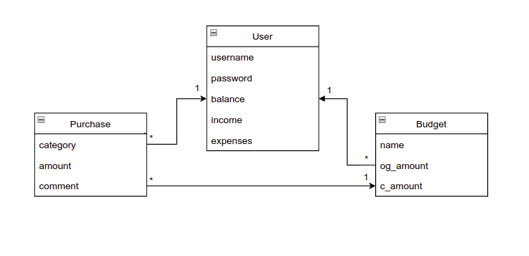
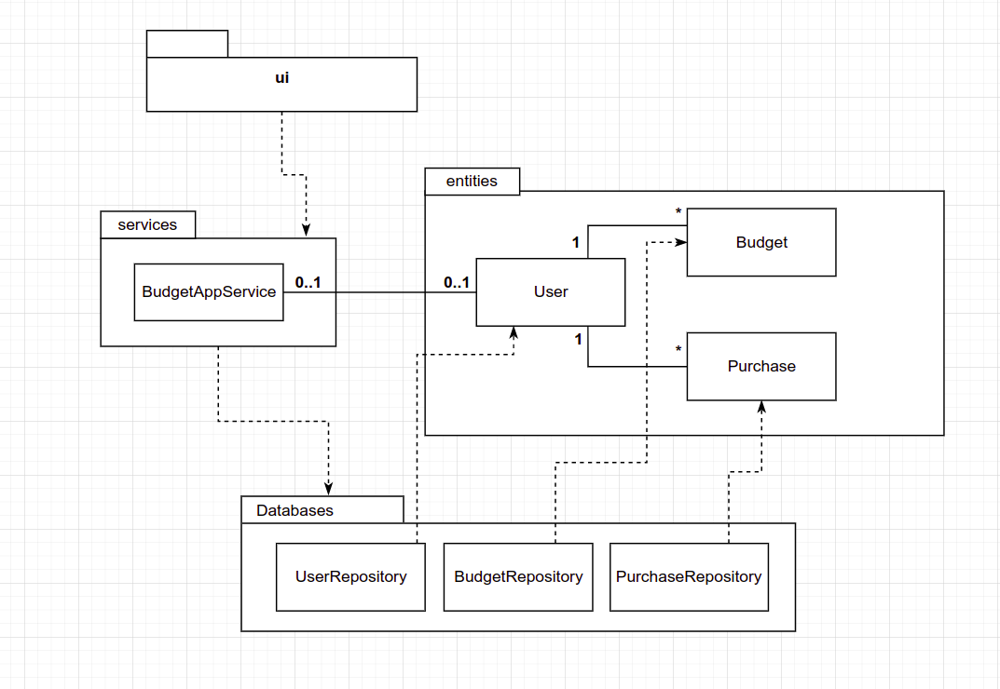

# Architecture
The structure of the program is the following:

The UI-folder contains code for the user interface, the service-folder contains the code for the application logic, the entities-folder contains the different items used by the program. The databases-folder contains the database where data is stored. 
## User Interface
The user interface consists of six different views:
- Login page
- Create User page
- Home page with budget list and user information
- Create Budget page
- Add Purchase page
- View History page

The UI-class decides which view is the current one, and there may only be one view present at a time. Each view is defined by an individual class, and all of them use the BudgetAppService-class methods when needed. As values are updated, the lists update using an initialize_list()-function for the specified list. 
## Data Storage
The database-folder contains the code for the database, which is based on three classes: UserRepository, BudgetRepository and PurchaseRepository. Each of these store data into tables in a SQL-database, which is initialized in the file init_database.py .
## Application Logic

## Main Functions

### Login

### Create User

### Create Budget

### Add Purchase

