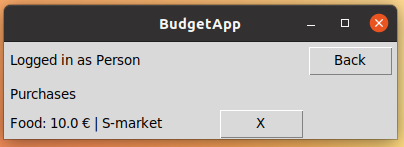
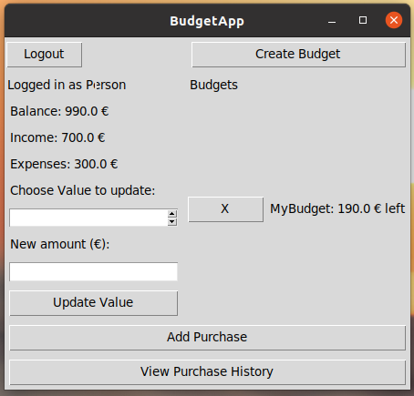

# Manual

## Launching the program

Install the required dependenscies using the command:

```bash
poetry install
```

Initialize a shell for the program using the command:
```bash
poetry shell
```

Then build the database using the command:

```bash
poetry run invoke build
```

Start the program using the command:

```bash
poetry run invoke start
```

## Login

After executing the commands above, the following window should pop up:


By entering an account's credentials it is then possible to log in by clicking the "Login"-button.

## Create new User

Pressing the "Create User"-button on the login screen switches the view to the create user window:


By entering a username that is not taken, and positive numbers in the balance-, income- and expenses-fields, a new user is created when pressing the "Create New User"-button.
The new user is then also logged in at the same time. There is also a "Login"-button that takes you back to the login page.

### Home page on first login:


## Create Budget

On the main page or home page, there is a "Create Budget"-button which takes the user to a new view:


 You can go back to the home page by pressing the "Back"-button.
 Once a name and a positive number as the budget amount has been given, the budget can be created by pressing the "Create Budget"-button.
 This will switch the view back to home page where the created budget can now be seen:
 
 
 
 Pressing the X-button deletes the budget.
 
 ## Add Purchase
 
 Once a budget has been created, you can add purchases to it by pressing the "Add Purchase"-button on the homepage. This will switch the view:
 
 
 
 To add a purchase, first select the budget you want to affect or type in the name of it. 
 Next, select a category or type in your own category.
 Then you type in the receipt amount of the purchase, a positive number.
 If you want, you can add a comment to the purchase
 
 By clicking the "Add Purchase"-button, the purchase is added to your purchase history and the amount is removed from your balance and budgets current amount.
 
 ## View Purchase History
 
 You can view your purchase history by pressing the "View Purchase History"-button on the home page. This switches the view:
 
 
 
 Pressing "Back" takes the user to the home page.
 By pressing the "X"-button next to a purchase, will delete it and put return the amount to the users balance and the affected budget.
 It is recommended to only do this if you input something wrongly when adding the purchase.
 
 ## Update balance,income or expenses
 
 On the home page the user can update their balance,income or expenses, by selecting the value they want to update and entering a positive number in the amount field:
 
 
 
 By pressing the "Update-value"-button, the value updates and the page refreshes with the new value now on display:
 
 
 
 
