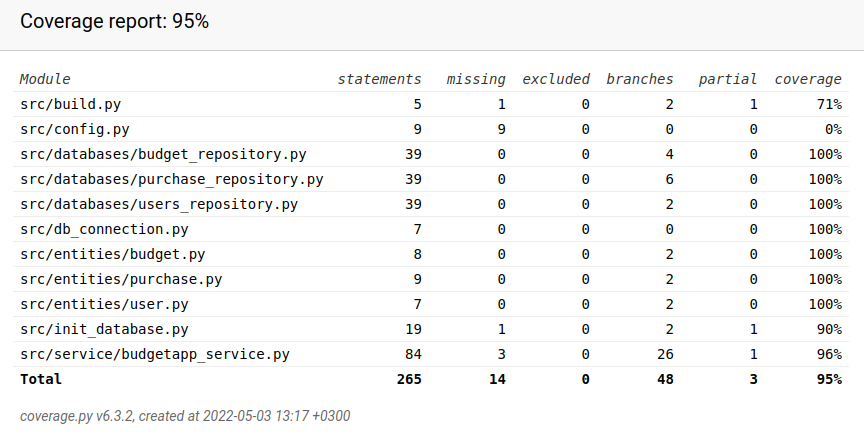

# Testing document

## Unit and integrated testing

### Application logic

The class (`BudgetappService`) of the application logic is tested with the [TestBudgetappService](https://github.com/NaND3R5/ot-harjoitustyo/blob/master/budgetapp/src/tests/service/budgetapp_service_test.py#L130)-testclass.
The `BudgetappService` has to be initialized with some form of repositories, and so in stead of using a permanent storage method here, the classes 
`FakeUserRepository`, `FakeBudgetRepository` and `FakePurchaseRepository` are introduced as temporary memory storage options. 

### Repository classes

Each class associated with the database, `UserRepository`, `BudgetRepository` and `PurchaseRepository`, are tested using the classes
[TestUserRepository](https://github.com/NaND3R5/ot-harjoitustyo/blob/master/budgetapp/src/tests/databases/user_repository_test.py), [TestBudgetRepository](https://github.com/NaND3R5/ot-harjoitustyo/blob/master/budgetapp/src/tests/databases/budget_repository_test.py) and [TestPurchaseRepository](https://github.com/NaND3R5/ot-harjoitustyo/blob/master/budgetapp/src/tests/databases/purchase_repository_test.py)
respectively. The name of the test-database is determined and configured by the [.env.test](../.env.test)-file.  

### Test coverage

## System testing

The system testing is done manually.

### Installation and configuration

After downloading the application, it is tested by first following the instructions in the [manual](./kayttoohje.md).

### Functionalities

All of the functionalities in the [Specifications of Requirements](./vaatimusmaarittely.md)-document and the manual have been tested one by one.
All exceptions and errors have also been tested, such as negative inputs and string-types in number-requiring fields etc.
